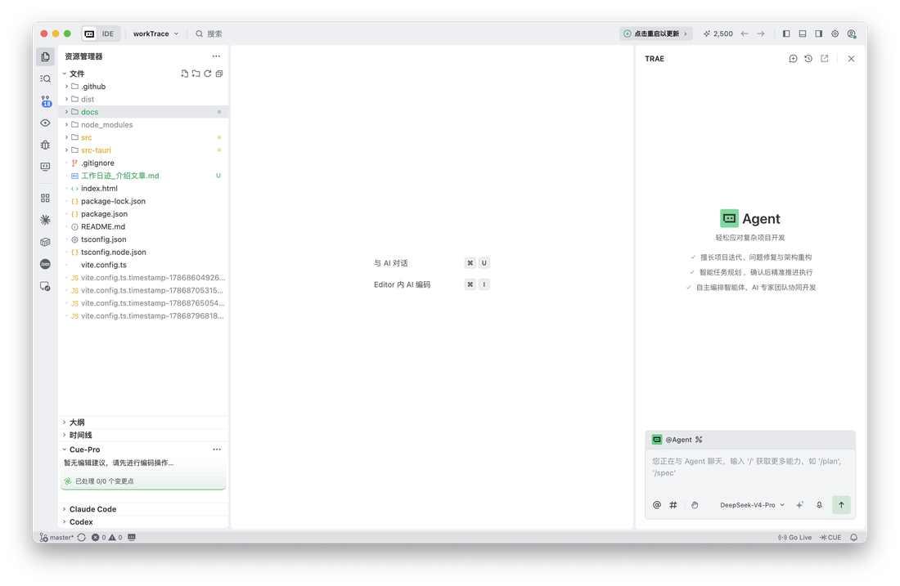
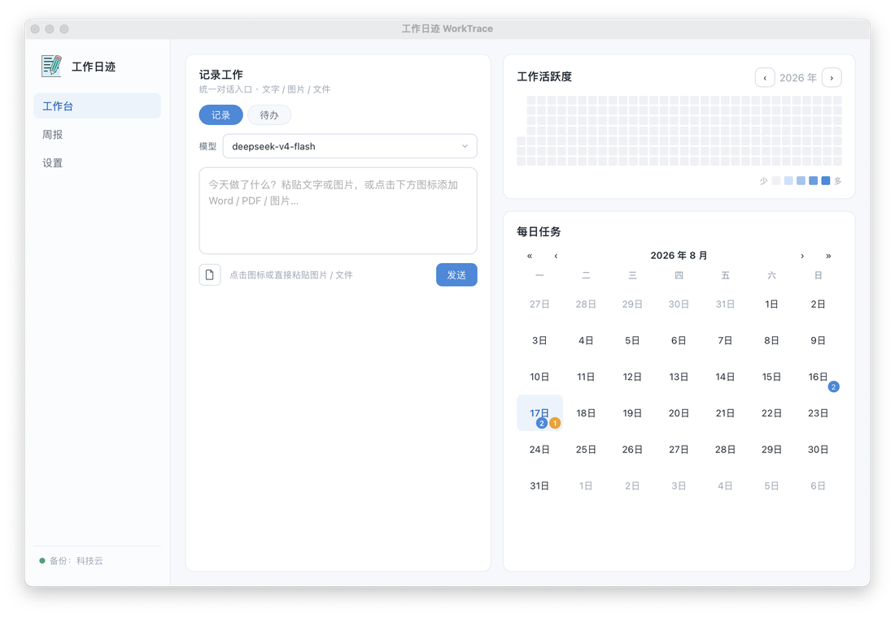
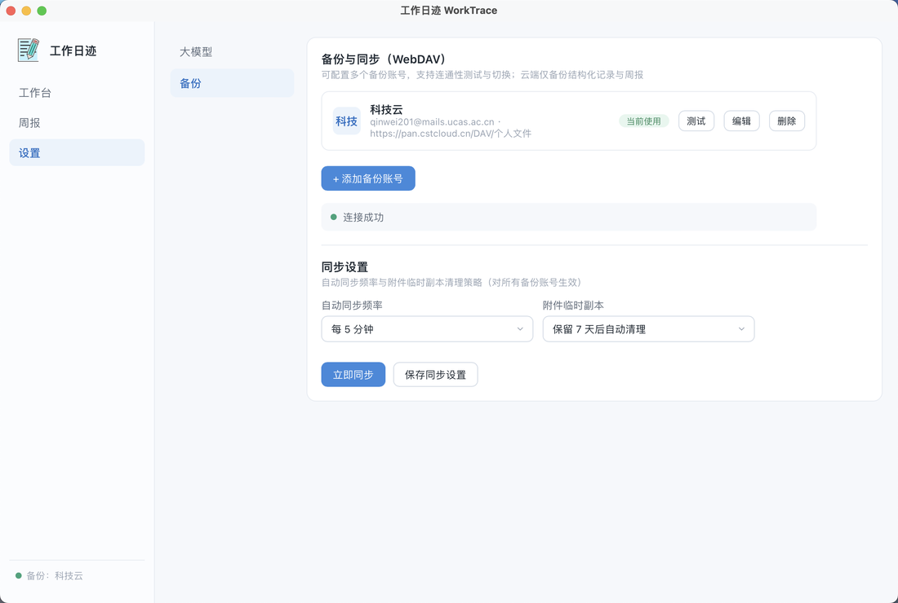

# 从一句「想省点写周报的时间」开始，我用 Trae 迭代出了「工作日迹」

> 按「真实痛点 → 实操过程（需求驱动的 AI 迭代开发）→ 落地成果 → 复用经验」展开。

每周五写周报，都是我的一劫：翻聊天记录、翻 commit、翻邮箱，把一周干的活一点点拼回来，还是常常漏掉那些「顺手做的小事」。我想要一个工具——随手记一笔，剩下的整理、回顾、写周报都自动完成。

我没有系统学过桌面开发。最终把这个工具做出来，靠的不是手写几百行代码，而是**用 Trae 一步步「聊」出来的**。

## 一、真实痛点

先明确要解决的问题，这也是整个开发的起点：

1. **记录散落、回忆断层**：每天干的事散在聊天窗口、便签、脑子里，周五写周报变成「考古」，琐碎工作漏记超过三成。
2. **周报凑字数**：想不起来就只能写「完成若干项工作」这种空话。
3. **待办和完成混在一起**：想做的、正在做的、做完的搅成一锅，分不清优先级。
4. **数据没保障**：记录存在本地某个角落，换电脑就担心丢。

## 二、实操过程：用自然语言驱动 Trae 迭代开发



整个过程没有手写大段代码，核心是「**我用一句话描述想要什么 → Trae 制定计划、拆解成具体改动 → 跑起来验证 → 发现问题继续反馈 → 一版一版改**」。下面是几个真实迭代片段。

**① 起步：从一句话需求到可运行的应用**

我先用一句需求定方向：「做一个本地优先的工作日志工具，能随手记录、AI 自动结构化、可视化回顾、一键生成周报」。Trae 没有让我去读一堆框架文档，而是先梳理出技术方案（Tauri 2 + React + Rust）、拆出数据模型（按天存 JSON 的记录结构）、搭出能跑的骨架。我先拿到一个能打开、能输入的雏形，再开始一轮轮细化。

**② 加「待办」功能：一次典型的需求 → 计划 → 实现 → 修复**

我提需求（原话）：「新增待办内容，和工作内容记录区分，加『记录 / 待办』切换按钮，日历里用不同颜色标记」。

Trae 制定的计划分四层：给记录加 `kind` 字段区分类型 → 后端新增待办入库命令 → 前端加切换按钮 → 日历加蓝/橙双色徽章。

跑起来后发现一个 bug——日历的橙色待办标记一直不显示。我把现象反馈回去，Trae 定位到根因：后端结构体漏了 `camelCase` 字段名转换，导致 `todo_count` 和前端读的 `todoCount` 对不上。一行改动修好。**这就是迭代的常态：先有功能，再一轮轮打磨细节。**

**③ 修科技云盘同步：报错 → 定位 → 修复的完整链路**

我反馈报错（原话）：「APP 同步时，选择科技云盘同步，报错 Read-only file system (os error 30)」。

Trae 没有直接改，而是先复现：直接请求科技云的 WebDAV 接口，发现它返回的文件路径是完整 URL 且带双斜杠（`.../worktrace//records/...`），解析出来的相对路径带了前导斜杠，被当成绝对路径写到了系统根目录（只读）。根因找到，`trim` 掉斜杠即修复。**这种「先复现、再定位、后修复」的方式，比盲改高效得多。**

**④ 修 kimi-k3 模型：一次修出两个根因**

我反馈：「kimi-k3 模型使用出错」。Trae 直连测试后发现问题有两层：这个推理模型只允许 `temperature=1`（代码里写死了 0.3，直接 400）；而且它返回的 JSON 结构不合规（任务字段返回成了对象数组）。于是双管齐下：遇到 400 自动去掉 temperature 重试；同时强化提示词 + 解析失败时把错误反馈给模型重试一次。修完后 kimi-k3 能正常结构化记录了。

**⑤ 修「删除功能没反应」：一个隐蔽的平台坑**

我反馈：「记录/待办的删除功能无法使用」。排查后发现根因很隐蔽：删除前的二次确认用了 `window.confirm`，而 Tauri 的 WebView 默认不实现原生 `confirm`，它直接返回 `false`，删除逻辑一进来就退出了。改成界面内联二次确认（点「删除」→ 变「确认删除」）才真正生效。

**⑥ 图片识别用 OCR、内置 PaddleOCR**

我提需求：「图片内容的识别通过 OCR 即可」。后来又补一句「希望 PaddleOCR 直接内置，无需人工配置」。Trae 据此把图片识别从「需要用户自己配视觉模型」改成了「内置 PaddleOCR，开箱即用」，mac / Windows 行为一致。

**⑦ 打包发布：一句话触发双平台安装包**

最后我要「生成 mac 的 dmg 和 windows 的 exe，放到 GitHub Releases 供下载」。Trae 配好 GitHub Actions 双平台打包流水线，中途还修了一个坑：release 创建了却不见安装包——因为发布脚本的文件匹配没覆盖子目录。平铺安装包后，打一个版本号 tag 推送，dmg 和 exe 就自动构建发布了。

## 三、落地成果

最终交付的是一个完整可用的桌面应用「工作日迹」，以及可复现的工程化产物：

- **一个能用的 APP**：记录（AI 结构化）+ 待办（与记录分离）+ 年度热力图 + 月历双色标记 + 一键四板块周报 + WebDAV 多账号备份同步。
- **双平台安装包**：macOS `.dmg` + Windows `.exe`，GitHub Actions 自动构建发布。
- **一套工程沉淀**：需求说明书、开发文档、开发经验总结（踩坑记录），方便后续迭代。





## 四、复用经验（AI 编程的提效方法）

如果你也想用 AI 编程工具把想法做成产品，这几条是这次实战最值钱的经验：

**1. 需求用「一句话 + 明确边界」提**
- 好的提法：「新增待办，和记录区分，加记录/待办切换，日历不同颜色标记」——有目标、有交互、有呈现。
- 差的提法：「做个待办功能」——太模糊，AI 只能猜，返工多。

**2. 报错不要只说「坏了」，带上完整信息**
「科技云同步报 Read-only file system (os error 30)」比「同步报错」有价值得多。让 AI 先复现、再定位，比直接让改更靠谱。

**3. 接受「先跑通，再打磨」的节奏**
第一版往往有 bug（比如日历待办标记不显示），这是正常的。关键是跑起来后能快速反馈、快速修，一版一版收敛，而不是追求一步到位。

**4. 让 AI 沉淀工程文档**
每个坑修完，让 AI 把「现象 → 根因 → 解决」记进文档。这次积累的 11 条踩坑记录，就是后续迭代和复用的最大资产。

**5. 可复用的架构思路**
「入口零摩擦（一句话/粘贴）、出口一键交付（周报/导出）、中间交给 AI」这条主线，套到会议纪要、读书笔记、客户跟进工具上都成立。

---

这就是我用 Trae 从一句需求迭代出「工作日迹」的全过程：没有死磕代码，而是把「我想要什么」讲清楚，让工具去计划、去实现、去修 bug，我只管验证和提反馈。如果你有想法但卡在「不会写代码」，不妨试试这条路。

## 项目地址与安装包下载

- **代码仓库**：https://github.com/qw-null/workTrace
- **安装包下载**（GitHub Releases）：https://github.com/qw-null/workTrace/releases

最新版本 **v0.1.1**：

| 平台 | 文件 | 下载 |
|---|---|---|
| macOS（Apple Silicon） | `workTrace_0.1.1_aarch64.dmg` | [下载](https://github.com/qw-null/workTrace/releases/download/v0.1.1/workTrace_0.1.1_aarch64.dmg) |
| Windows（x64） | `workTrace_0.1.1_x64-setup.exe` | [下载](https://github.com/qw-null/workTrace/releases/download/v0.1.1/workTrace_0.1.1_x64-setup.exe) |

> macOS 安装包当前未签名，首次打开可能提示「无法打开，因为无法验证开发者」。两种解决办法：

**方法一（图形界面）**：打开「系统设置 → 隐私与安全性」，在底部找到被拦截的应用，点击「仍要打开」。

**方法二（命令行，推荐）**：在终端执行下面命令，移除隔离属性后即可正常打开：

```bash
xattr -cr /Applications/workTrace.app
```
